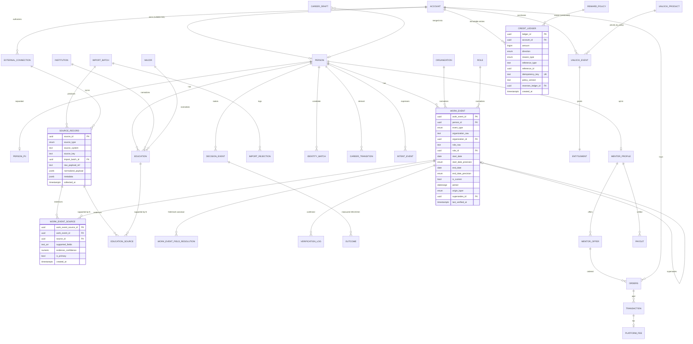

# HELLOMYME Career — Pre-Implementation Architecture Review v0.1

> Master Prompt v1.2의 "코드를 쓰기 전에 먼저 보여줄 것" 10개 항목.
> 입력: `HELLOMYME_Career_DB_Architecture_v1.2.xlsx`, `HELLOMYME_PreSeed_Career_Data_v1.1.xlsx`, `HELLOMYME_PreSeed_CSV_v1.1.zip`
> 데이터 수치는 `scripts/profile_preseed.py`로 재현 가능 (기준일 2026-10-07).
> 이 문서는 승인 전 설계안이며, 아직 schema/migration/import 코드는 작성하지 않았다.

---

## 1. UNDERSTANDING

**제품 한 줄:** 학교·학과·경력을 입력하면 "나와 비슷한 사람들이 실제로 선택한 다음 경로"를 집단 통계로 보여주고, 그 경로를 먼저 간 선배와 연결하는 Career Decision Network.

**핵심 원칙 (설계를 제약하는 것만 추림)**

| 원칙 | 설계에 주는 의미 |
|---|---|
| 정답 추천이 아닌 evidence-based exploration | 내부 similarity score ≠ 사용자 노출값. "정확도 %" 노출 금지 |
| Flywheel: DATA → … → BETTER DATA | 입력·재확인·Outcome이 모두 canonical data로 되돌아와야 함 (reward 연동) |
| PRE_SEED / SEED / VERIFIED 단일 canonical model | 테이블 분리가 아니라 `data_layer` + provenance로 구분 |
| raw never overwritten, unknown = NULL | raw/normalized 컬럼 분리, append-only source, 추론 채움 금지 |
| One WORK_EVENT ← N SOURCE_RECORD (v1.2) | `work_event_source` junction + field-level `supported_fields` |
| Immutable ledger, idempotent rewards/imports | `credit_ledger` UPDATE/DELETE 금지, 모든 쓰기에 idempotency key |
| Small cohort suppression (default 30) | 모든 집계 API가 threshold를 강제하는 단일 경로를 통과 |
| PostgreSQL first, no Graph DB | transition은 derived table / materialized view |

**MVP 사용자 플로우**
Student/Professional 선택 → Career Input (익명 draft) → Teaser → Login Wall → draft merge → Career Map → `1 MY` Unlock → Deep Dive → Relevant Senior → Q&A/짧은 세션.

---

## 2. CURRENT REPOSITORY ANALYSIS

| 항목 | 상태 |
|---|---|
| Repository | `youngmindo/next-path`, 브랜치 `claude/new-session-5zbbk9` |
| 커밋 | **0개 (빈 저장소)** — 기존 코드·스택·CI·컨벤션 없음 |
| 결론 | Greenfield. "기존 구조와의 호환성" 리스크는 없지만, **스택 결정이 선행 조건** (§10 Q1) |

**스택 제안 (결정 필요)**

| 옵션 | 장점 | 단점 |
|---|---|---|
| **A. Python (FastAPI + SQLAlchemy Core + Alembic) + Next.js 프론트** — 권장 | Import/validation/similarity가 데이터 작업이라 pandas·pytest와 한 언어로 처리. Alembic은 raw SQL migration(range type, exclusion constraint, materialized view)을 그대로 수용 | 백엔드/프론트 2개 언어. 소규모 팀이면 컨텍스트 스위칭 비용 |
| B. TypeScript 풀스택 (Next.js + NestJS/Fastify + Drizzle/node-pg-migrate) | 한 언어, 채용 풀 넓음, 저장소명(Next-path)과 맞을 수 있음 | 대용량 import·통계 처리가 Python보다 번거로움. Prisma 선택 시 range type·exclusion constraint·MV 지원이 약해 raw SQL로 우회 필요 |

근거: PostgreSQL range type/exclusion constraint — https://www.postgresql.org/docs/current/rangetypes.html , Alembic — https://alembic.sqlalchemy.org/ , Prisma의 미지원 DB 기능 우회 문서 — https://www.prisma.io/docs/orm/prisma-migrate/workflows/unsupported-database-features

---

## 3. DATA ARCHITECTURE REVIEW

### 3.1 Pre-seed 패키지 개요

| 파일 | 행 수 | 비고 |
|---|---|---|
| persons | 20,000 | PROFESSIONAL 17,429 / STUDENT 1,865 / JOB_SEEKER 706 |
| educations | 20,000 | 1인 1건, 전부 BACHELOR |
| work_events | 46,091 | EMPLOYMENT 44,993 / FREELANCE 725 / SIDE_BUSINESS 373 |
| work_event_sources | 46,091 | 1 event : 1 source, 전부 `is_primary=True`, `evidence_confidence` 전부 NULL |
| institutions / majors / roles / organizations | 24 / 20 / 22 / 30 | taxonomy |

- CSV와 XLSX는 동일(work_events id·start_date 전수 비교 일치). → **CSV를 import 원천으로 사용**, XLSX는 참조용.
- 모든 CSV에 UTF-8 BOM 존재 → importer가 `utf-8-sig`로 처리해야 함.
- 참조 무결성: orphan 0건, ID 중복 0건, `source_ref = PRESEED_V1_{person_id}` 100% 일치.

### 3.2 데이터 품질 이슈 (import 정책 결정 필요)

| # | 이슈 | 건수 | 영향 | 제안 처리 (no fabrication 원칙 준수) |
|---|---|---|---|---|
| D1 | `end_date < start_date` | 376 events (376명, 전부 2026년) | tenure 음수, transition 순서 오류 | **REJECT → `import_rejection`에 보관**. 날짜 swap 등 보정 금지 |
| D2 | 기준일 이후 시작 (`start_date > 2026-10-07`) | 1,136 (그중 `is_current=True` 974) | "현재 재직 중인데 미래 입사" 모순 | WARNING + `is_future_dated` 플래그. Career Map 집계에서 기준일 이후 이벤트 제외 |
| D3 | 기준일 이후 종료 | 299 (`is_current=False`) | 종료 확정 아님 | WARNING. 집계 시 기준일로 truncate하지 않고 제외 or 별도 처리 |
| D4 | `end_date = start_date` | 440 | tenure 0개월 | WARNING (월 단위 정밀도라 0~1개월 가능) |
| D5 | JOB_SEEKER 706명 **전원** 현재 EMPLOYMENT 보유 | 706 | `user_stage`와 이벤트 모순 | raw `user_stage`는 보존, 제품 로직은 **이벤트 기반 derived stage** 사용 |
| D6 | 창업자 역할(ROLE021)이 `EMPLOYMENT`로 기록 | 1,617 | STARTUP 이벤트 타입 0건 → "창업으로 간 사람" 통계 왜곡 | 자동 재분류 금지. normalization warning + taxonomy v2에서 규칙화 여부 결정 (§10 Q4) |
| D7 | ORG030 "창업/자영업", ORG019~021 "스타트업 A/B/C" 등 placeholder 조직 | 3,477 + α | 회사 단위 통계 의미 약함 | `organization.is_placeholder=true`; company-level 통계에서 제외, company_type 통계에는 포함 |
| D8 | `industry=STARTUP` | — | 산업과 회사 단계(stage)가 한 축에 섞임 | taxonomy에서 `industry`와 `company_stage` 분리 (v2) |
| D9 | 병행 이벤트 | 977명 다중 current, 겹침 793쌍 (EMP>FREELANCE 477, EMP>SIDE 246, EMP>EMP 70) | 단순 정렬로 transition 계산 시 오류 | parallel event 모델 + "primary track" 규칙 (§4.3) |
| D10 | 모든 날짜가 1일 | 100% | 실제 정밀도는 월 | `start_date_precision` = `MONTH` 컬럼 |
| D11 | 동일 (학교·학과·졸업년도·경력시퀀스) 프로필 | 1,413명 | 합성 데이터 특성 | **dedup으로 병합하지 않음** (별개 person_id). 리포트에만 표시 |
| D12 | `generation_confidence` (0.72~0.98) | 20,000 | 진실 확률이 아님 | `source_record.metadata`에 보관, similarity/ranking에 사용 금지 |
| D13 | 전문가 중 current 이벤트 없음 | 1,406 | — | 정상 (career break 등). NULL 유지, 추론 금지 |

### 3.3 Cohort 밀도 — 제품 설계에 가장 큰 영향

| Cohort 단계 | 셀 수 | 30명 미만 셀 | 해석 |
|---|---|---|---|
| School | 24 | 0 (508~1,417명) | 충분 |
| Major | 20 | 0 (507~2,014명) | 충분 |
| School + Major | 480 | **162 (34%)** | 1/3이 상세 통계 불가 |
| School + Major + Graduation year | 6,277 | **6,277 (100%)**, 최대 21명 | **단일 졸업년도 cohort는 전부 suppression** |
| Major + 첫 직무 | 178 | 72 | 경력 시퀀스 단계부터 급격히 희소 |

**시사점:** 20,000명 규모에서는 Progressive cohort의 4단계(Graduation Cohort) 이후가 threshold 30을 넘지 못한다. 따라서
1. Graduation cohort는 단일 연도가 아닌 **연도 밴드(±2년 등, config)** 로 정의
2. 각 단계에서 threshold 미달 시 **상위 단계로 자동 relax**하고 "이 단계는 표본 부족" 상태를 UI에 노출
3. "Highly Similar Journeys"는 정확 매칭이 아닌 similarity top-K **집계**(K ≥ threshold)로만 제공

이것은 실데이터(SEED/VERIFIED)에서도 초기엔 동일하게 나타날 구조적 문제다.

### 3.4 Architecture v1.2 문서 Gap

| # | Gap | 제안 |
|---|---|---|
| G1 | `verification_level` 값이 시트마다 다름 (05: `PRE_SEED/OBSERVED/…` vs 08: `UNVERIFIED/SELF_REPORTED/SOURCE_VERIFIED/SELF_RECONFIRMED`) | v1.2(08) 기준으로 통일. `data_layer`와 의미 중복 제거 |
| G2 | EDUCATION에 provenance·multi-source 구조 없음 | `education_source` junction 추가 (Phase 2 학력 증빙 대비, WORK_EVENT와 대칭) |
| G3 | Anonymous draft 엔티티 없음 | `career_draft` (anon token, payload, merged_into_person_id, merge idempotency) |
| G4 | 필드 단위 canonical resolution 기록 없음 | `work_event_field_resolution` (field, chosen_value, winning_source, rule_version, resolved_at) |
| G5 | Unlock 가격·reward 정책 테이블 없음 ("hard-code 금지"와 충돌) | `unlock_product`, `price_policy(version)`, `reward_policy(version)` |
| G6 | UNLOCK_EVENT와 entitlement 혼재 | `unlock_event`(구매 사실) / `entitlement`(접근권, 만료 가능) 분리 |
| G7 | PII 분리 테이블 없음 | `person_pii` (이름·연락처 등) 별도 테이블 + 별도 권한 |
| G8 | Career transition derived 엔티티 정의 없음 | `career_transition` (logic_version 포함) |
| G9 | `ORDER`는 SQL 예약어 | 테이블명 `orders` |
| G10 | SENIORITY taxonomy는 있으나 데이터에 없음 | 컬럼은 nullable로 두고 PRE_SEED는 NULL |
| G11 | `data_layer`가 이벤트 단위일 때 member가 SEED 이벤트를 확인하면? | 원 레코드의 `origin_layer`는 불변, member 확인 시 VERIFIED 이벤트를 **새로** 만들고 `supersedes`로 연결 (overwrite 금지) |
| G12 | PRE_SEED person이 실회원과 identity match 될 가능성 | PRE_SEED는 identity resolution 대상에서 **원천 제외** (가상 인물) |
| G13 | 버전 표기 불일치 (Prompt는 Arch v1.1/PreSeed v1.0, 파일은 v1.2/v1.1, XLSX README는 v1.0) | 실제 파일 버전 기준, `import_batch.dataset_version` 기록 |

### 3.5 v1.2 요구사항 검증: WORK_EVENT_SOURCE & field-level evidence

| 체크 | 결과 |
|---|---|
| WORK_EVENT에 단일 source_id 종속 없음 | ✅ 제안 schema에서 `work_event`에 source FK 없음. provenance는 junction으로만 |
| `supported_fields` field-level 보존 | ✅ `text[]` + CHECK (허용 필드 목록) + GIN index |
| 외부 source가 회사/기간만 줄 때 role을 SOURCE_VERIFIED로 간주하지 않음 | ✅ 필드별 verification은 `supported_fields`에 해당 필드가 있을 때만 계산 (view에서 파생) |
| provider-specific payload가 canonical에 들어가지 않음 | ✅ raw는 `source_record.raw_payload_ref`(object storage) + `normalized_payload jsonb`에만 |
| Pre-seed CSV가 이미 이 구조를 따름 | ✅ `work_event_sources.csv` 존재. 단 `source_ref`가 person 단위 → **SOURCE_RECORD 20,000건(1인 1건)** 으로 매핑 |

---

## 4. PROPOSED ARCHITECTURE

### 4.1 레이어

```
[Client: Next.js]
   │  REST (AUTH / PROFILE / CAREER / MAP / UNLOCK / CREDIT / MENTOR / ORDER)
[API]  ── policy: cohort threshold, authz, idempotency middleware
   │
[Domain services]  cohort · similarity v0 · transition(versioned) · ledger · reward · mentor ranking
   │
[PostgreSQL]
   ├─ taxonomy  (institution, major, organization, role, *_version)
   ├─ core      (account, person, person_pii, education, work_event, intent/decision/outcome)
   ├─ provenance(import_batch, source_record, work_event_source, education_source, verification_log, field_resolution, identity_match)
   ├─ staging   (stg_* raw text tables, import_rejection, qa_review)
   ├─ derived   (career_transition, cohort_agg MVs)
   ├─ commerce  (credit_ledger, unlock_*, entitlement, mentor_*, orders, transaction, platform_fee, payout)
   └─ analytics (analytics_event — canonical과 물리적으로 분리된 schema)
```

### 4.2 주요 설계 결정

| 결정 | 이유 | 대안 및 기각 이유 |
|---|---|---|
| PK는 UUID, 원천 ID(`PSP00001`)는 `source_key` + `(source_system, source_key)` UNIQUE | 원천 ID 체계가 source마다 다름. idempotent upsert 키 | 원천 ID를 PK로 사용 → SEED/VERIFIED와 충돌 |
| `work_event.period daterange` + `start_date`, `end_date`, `*_precision` | 병행 이벤트 겹침 쿼리(`&&`)와 GiST 인덱스 | 시작/종료만 저장 → 겹침 쿼리가 복잡 |
| Overlap **허용** (exclusion constraint 없음) | 병행 경력이 정상 케이스 | — |
| `credit_ledger`는 INSERT-only (trigger로 UPDATE/DELETE 차단), 잔액은 SUM view/스냅샷 | 감사 가능성, reversal로만 정정 | balance 컬럼 직접 갱신 → race·감사 불가 |
| 모든 상태 변경 API에 `Idempotency-Key` | 결제·reward·merge 중복 방지 | — (Stripe 방식 참고: https://docs.stripe.com/api/idempotent_requests ) |
| Cohort 집계는 materialized view + `REFRESH CONCURRENTLY` | 20k~수백만 person에서 실시간 group-by 비용 회피 | Graph DB → 원칙상 금지, 현 규모에 불필요 ( https://www.postgresql.org/docs/current/rules-materializedviews.html ) |
| Suppression은 DB view가 아닌 **단일 API policy 함수** + 테스트 강제 | threshold가 config이고 unlock 수준별로 다를 수 있음 | view에 하드코딩 → config 변경 시 migration 필요 |

### 4.3 Career Transition v1 (versioned)

- 입력: person의 `work_event` 중 `as_of` 이전 시작, REJECT 제외.
- **Primary track** = EMPLOYMENT/STARTUP/SELF_EMPLOYED/STUDY/MILITARY/CAREER_BREAK. SIDE_BUSINESS/FREELANCE/PROJECT는 **parallel track** (primary와 겹칠 때).
- Transition = primary track에서 이벤트 A의 다음 시작 이벤트 B. 겹치는 EMPLOYMENT>EMPLOYMENT(70쌍)는 `overlap_months` 기록 후 transition으로 인정.
- Parallel track은 "병행 선택" 통계(예: "재직 중 사이드 비즈니스 시작 비율")로 별도 제공.
- 결과는 `career_transition(logic_version='v1', ...)`에 저장 → 로직 변경 시 v2를 병행 계산, 비교 후 전환.

### 4.4 Similarity Engine v0

- `score = Σ wᵢ · simᵢ(feature)` ; 가중치는 `similarity_config(version, weights jsonb)`.
- 범주형 = exact match(0/1), taxonomy 계층 = 부분점수(같은 major_family 0.5 등), 졸업년도 = 거리 감쇠, 경력 시퀀스 = role/job_family 시퀀스의 정규화 편집거리.
- 사용자 노출: 점수 대신 **"매우 비슷 / 비슷 / 참고"** 버킷 + "학교·학과·직무가 같아요" 같은 근거 문장. calibration 전 % 노출 금지.

### 4.5 데이터 레이어 노출 정책 (사업적 판단 필요 — §10 Q2)

PRE_SEED는 "Not observed real-person data"다. 실사용자에게 이것을 "비슷한 사람들의 실제 선택"으로 보여주면 제품 핵심 메시지와 정면 충돌한다.

| 옵션 | 장점 | 단점 |
|---|---|---|
| **A. PRE_SEED는 dev/staging/demo 전용, prod 집계 제외** — 권장 | 신뢰·법적 리스크 최소. 원칙("실제 회원 검증 데이터로 표현하지 않는다")과 일치 | 런칭 초기 Career Map이 비어 보임 → SEED 확보가 런칭 전제 |
| B. prod 포함 + "예시 데이터" 명시 라벨 | 콜드스타트 UX 유지 | "실제 선택" 가치 제안 훼손, 표시광고법상 오인 소지 검토 필요 ( https://www.law.go.kr/법령/표시ㆍ광고의공정화에관한법률 ) |
| C. prod에서 SEED/VERIFIED만 집계, cohort 미달 시 PRE_SEED 기반 "구조 미리보기"(수치 없음) | 빈 화면 회피 + 수치 왜곡 없음 | 구현 복잡도 증가 |

---

## 5. ERD (Mermaid)



---

## 6. PRE-SEED IMPORT PLAN

### 6.1 파이프라인

```
CSV (utf-8-sig)
 → [1] stage: stg_* 테이블에 전 컬럼 TEXT로 원본 그대로 적재 (+ file sha256, row_number)
 → [2] validate: 타입·enum·FK·날짜 범위 (D1=REJECT, D2~D4=WARNING)
 → [3] normalize: taxonomy 매핑(현 데이터는 ID 직결), date precision=MONTH, is_placeholder
 → [4] dedup: (source_system='PRESEED_V1', source_key) 기준 — 재실행 시 no-op. 프로필 유사 중복(D11)은 병합하지 않음
 → [5] import: 단일 트랜잭션, UPSERT ON CONFLICT (source_system, source_key) DO NOTHING
 → [6] integrity check: count 대사, FK, junction 1:1, rejected+imported = staged
 → [7] aggregate: career_transition v1 계산, cohort MV refresh
 → report (JSON + Markdown)
```

### 6.2 매핑

| CSV | → 테이블 | 비고 |
|---|---|---|
| institutions/majors/roles/organizations | taxonomy (version=`preseed_v1.1`) | `source_key`=원 ID. organizations에 `is_placeholder` (D7) |
| persons | `person` (origin_layer=PRE_SEED) + `source_record` 1건/인 | `user_stage`는 `person.declared_stage_raw`, `generation_confidence`는 source_record.metadata |
| educations | `education` + `education_source` | `institution_raw`/`major_raw`에 taxonomy 이름 기록 |
| work_events | `work_event` | `is_current`·dates 그대로, `period` 계산 |
| work_event_sources | `work_event_source` | `source_ref` → person 단위 source_record로 연결, `supported_fields` 배열 변환 |

### 6.3 Idempotency 보장

- `import_batch(dataset_name, dataset_version, file_sha256[])` UNIQUE → 같은 파일 재실행 시 기존 batch 반환.
- 행 단위 `(source_system, source_key)` UNIQUE → 부분 실패 후 재실행도 안전.
- 테스트: 2회 연속 import 후 모든 테이블 row count 동일 + report의 `inserted=0`.

### 6.4 예상 리포트 (현 데이터 기준)

| 항목 | 예상값 |
|---|---|
| persons | 20,000 |
| education records | 20,000 |
| work events imported | 45,715 (= 46,091 − 376 rejected) |
| work_event_sources | 45,715 |
| organizations / roles | 30 / 22 |
| rejected records | 376 (D1) + 연쇄된 work_event_source 376 |
| duplicate records | 0 (ID 기준) / 유사 프로필 1,413 (정보성) |
| normalization warnings | D2 1,136 · D3 299 · D4 440 · D5 706 · D6 1,617 · D7 placeholder org 사용 이벤트 |

---

## 7. MVP SCOPE

| 포함 (MVP) | 제외 (후속) |
|---|---|
| Student/Professional 입력, 0..N 병행 Career Event | LinkedIn/보험/문서 실제 연동 (schema만 대비) |
| Anonymous draft → teaser → login → idempotent merge | 강의/Salon/Activity/Company visit/Project 마켓 |
| Career Map: 다음 직무군·산업·회사유형/규모·이벤트타입·평균 재직·전환 시점·대표 경로 | ML 기반 similarity, calibration된 확률 노출 |
| Progressive cohort + relax + suppression(30) | Graph DB, 실시간 스트리밍 집계 |
| MY ledger, unlock/entitlement, 정책 테이블 기반 가격 | 실결제 PG 연동은 Q3 결정에 따라 |
| Contribution reward (가입, 학교/학과, 현재 직무, 이전 경력, 재확인) | Outcome 장기 추적 UI (테이블은 생성) |
| Mentor opt-in 프로필, matching, Q&A/15분 offer, order | Payout 자동 정산 (수동 정산 + 테이블 기록) |
| Analytics event 15종, KPI 쿼리 | BI 대시보드 |

---

## 8. IMPLEMENTATION PLAN

Master Prompt의 18단계를 PR 단위로 묶음. 각 PR 착수 전 WHAT/WHY/SCHEMA IMPACT/MIGRATION/PRIVACY/TEST를 PR 본문에 기재.

| PR | 범위 (Prompt 단계) | 산출물 | 완료 기준 |
|---|---|---|---|
| 0 | 이 문서 (1~6) | review, profiling script | 결정사항 §10 승인 |
| 1 | 스택 scaffold, Docker PostgreSQL 16, CI, migration 도구 | 빈 앱 + `make test` | CI green |
| 2 | Migration 1~3: taxonomy, provenance, account/person/pii, education, work_event, junctions | up/down migration | rollback 왕복 테스트 |
| 3 | Import 파이프라인 (7~8) | importer CLI + report | idempotency·count 대사 테스트 |
| 4 | Transition v1 + cohort MV + suppression policy (9) | derived tables | threshold 미달 셀 노출 0건 테스트 |
| 5 | Similarity v0 (10) + Career Map API (11) | `/career/map`, `/career/map/query` | 고정 fixture 결과 snapshot |
| 6 | Draft + merge (12) | `/career/draft*`, `/auth/merge-draft` | 동일 draft 2회 merge → 1회 효과 |
| 7 | Ledger/unlock/entitlement (13) + rewards (14) | `/credits*`, `/career/unlock` | 동시성·중복 key·reversal 테스트 |
| 8 | Mentor matching + minimum marketplace (15~16) | `/mentors*`, `/orders` | opt-in 미동의자 노출 0건 |
| 9 | Analytics + privacy hardening (17~18) | event 수집, 삭제/감사 | privacy test suite |

**Migration/Rollback 원칙:** 모든 migration은 up/down 쌍, CI에서 `up → down → up` 왕복. 데이터 migration(파괴적 변경)은 expand → backfill → contract 3단계로 나누고 contract는 별도 릴리스.

---

## 9. RISKS

| 구분 | 리스크 | 근거 | 대응 |
|---|---|---|---|
| **위기: 데이터 신뢰** | PRE_SEED(가상)가 "실제 선택"처럼 노출 | 데이터 README: "Not observed/verified real-person data" | §4.5 옵션 A, `origin_layer` 필터를 API policy에서 강제 |
| **위기: 콜드스타트** | 실데이터에서도 School+Major+연도 cohort는 30명 미달 | §3.3: 20k명에서도 100% 미달 | 연도 밴드, relax, SEED 수집을 특정 학교·학과에 **집중**(넓게 얇게 X) |
| **위기: 규제 — MY 크레딧** | 충전식 선불 크레딧은 전자금융거래법상 선불전자지급수단 해당 여부 검토 필요 | https://www.law.go.kr/법령/전자금융거래법 | 런칭 전 법률 자문. 환불·유효기간 정책을 ledger reason_type으로 표현 가능하게 설계 |
| **위기: 규제 — 개인정보** | 경력·학력은 개인정보, SEED 공개프로필 수집도 수집 근거 필요 | 개인정보보호법 https://www.law.go.kr/법령/개인정보보호법 | PII 분리, 수집 근거를 `source_record`에 기록, 삭제권 처리 플로우 |
| **위기: LinkedIn** | 자동 수집은 약관 위반 | LinkedIn User Agreement §8.2 https://www.linkedin.com/legal/user-agreement | Phase 2도 **본인 업로드**만. scraping 구현 금지 (Prompt와 일치) |
| 약점: 재식별 | 작은 학교×학과×회사 조합은 30명 이상이어도 재식별 가능 | k-anonymity 한계 (Sweeney 2002) https://dataprivacylab.org/dataprivacy/projects/kanonymity/kanonymity.pdf | 조합 필터 수 제한, 회사 단위는 placeholder 제외 + 별도 threshold |
| 약점: taxonomy 협소 | 학교 24·회사 30·직무 22 → 실사용자 입력 대부분 미매핑 | §3.1 | raw 보존 + `normalization_status=UNMAPPED` + 운영자 매핑 큐 |
| 약점: 이벤트 타입 왜곡 | 창업이 EMPLOYMENT로 기록(D6) → 창업 경로 과소집계 | §3.2 | taxonomy v2 규칙 + PRE_SEED는 데모 용도로 한정 |
| 기술 | Reward farming | Prompt 명시 | idempotency key = (account, reason, reference, policy_version) UNIQUE |
| 기술 | Draft merge 경합 | 로그인 직후 중복 요청 | merge도 idempotency key + `career_draft.merged_at` 조건부 UPDATE |

**강점·기회 (의사결정 참고)**
- 강점: 이미 v1.2에서 multi-source evidence 모델이 설계되어 있어, Phase 2 연동 시 schema 대수술이 필요 없다. Pre-seed 패키지도 이 구조(work_event_sources)를 따른다.
- 기회: VERIFIED + Outcome(3/6/12/24개월)이 쌓이면 "선택 이후 결과" 데이터는 공개 프로필 기반 서비스가 복제하기 어려운 longitudinal moat가 된다. 단 이 가치는 **재확인률(Reconfirmation Rate)** KPI에 달려 있으므로 reward 설계의 1순위로 둔다.

---

## 10. ASSUMPTIONS / QUESTIONS

### 가정 (이의 없으면 이대로 진행)
1. 기준일(`as_of`)은 config, 기본값 = 실행일. 미래 날짜 판정에 사용.
2. D1(end<start) 376건은 REJECT, 보정하지 않는다.
3. raw `user_stage`는 보존하되 제품 로직은 이벤트 기반 derived stage를 사용한다.
4. Pre-seed 원본 CSV/XLSX는 저장소에 커밋하지 않는다 (14MB, 비공개 데이터). 로컬/스토리지 경로를 인자로 받는다.
5. MY는 정수 단위, 가격·보상량은 정책 테이블에서만 조회.
6. 인증은 외부 IdP(소셜 로그인)로 가정, ACCOUNT는 IdP subject만 보관.

### 결정이 필요한 질문
| # | 질문 | 권장안 |
|---|---|---|
| Q1 | 스택: Python(FastAPI) vs TypeScript 풀스택? | A (Python + Next.js). 팀이 TS 중심이면 B |
| Q2 | 운영 환경에서 PRE_SEED 노출 정책 (§4.5 A/B/C)? | A |
| Q3 | MY 구매를 MVP에서 실결제로 할지, 무료 지급(contribution only)으로 먼저 검증할지? | 무료 지급 먼저 → 규제 검토 시간 확보 + 가치 검증 |
| Q4 | 창업자 역할의 EMPLOYMENT 기록(D6)을 normalization 규칙으로 STARTUP 재분류할지? | PRE_SEED에는 적용하지 않음 (데모용), 실데이터 입력 UI에서 타입을 명확히 받음 |
| Q5 | Graduation cohort 연도 밴드 기본값? | ±2년 (5개년) — 현 데이터 기준 School+Major+5년 밴드 밀도는 PR 4에서 측정 후 확정 |
| Q6 | 인증 방식 (카카오/구글/애플/이메일)? | 카카오 + 구글 |
| Q7 | 배포 환경 (AWS/GCP/Supabase 등)? | 관리형 PostgreSQL이면 무관. 결정 전까지 Docker Compose로 개발 |
