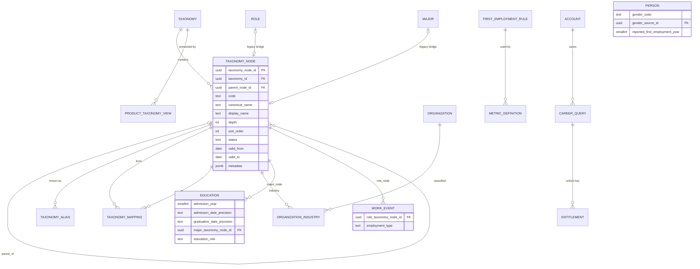

# Architecture v1.4 — Career Event × Time × Taxonomy

> Master Prompt v1.4 §25 gate, steps 1–2: architecture/ERD update and the migration delta from
> the current schema (migrations 0001–0011). Steps 3–4 (Pre-seed v1.3 and its validation) follow.
> Approved decisions from v1.3 are unchanged and not repeated here.

## 1. Gap analysis — current schema vs v1.4

| v1.4 requirement | Current state (0001–0011) | Gap |
|---|---|---|
| Hierarchical, versioned taxonomy for ROLE / INDUSTRY / MAJOR, unlimited depth | `role(job_family)`, `major(major_family)`, `organization.industry` (text) — fixed 2 levels, no versions per node, no aliases | **New taxonomy model**; existing tables become legacy and are mapped |
| ORGANIZATION as an entity, industry via junction | `organization.industry` text column | `organization_industry` junction + richer organization attributes |
| Raw labels kept beside normalized nodes | `role_raw`, `major_raw`, `organization_raw` exist | Keep; add `*_taxonomy_node_id` columns |
| Gender (no inference) | none | `person.gender_code`, `gender_source` |
| Admission year, independent of graduation year | `education.graduation_year` only | `admission_year`, precisions |
| First employment derived, versioned rule | entry transition hard-coded in `transition_v1` (event types, ≥ graduation year) | `first_employment_rule` (config) + `reported_first_employment_year` |
| Arbitrary `as_of_date` + lookback for every analytic | `career_person_snapshot` / `career_transition` computed for **one** as-of; transitions have **no dates** | **Blocking for v1.4 time model.** Replace "current"-pinned snapshot with query-time evaluation over dated events |
| Extensible target metrics | 1 hard-wired "next move" family + 4 insight types | `metric_definition` registry + metric implementations |
| Reusable `CAREER_QUERY` | ad-hoc `Profile` dataclass | `CareerQuery` DTO + optional persisted `career_query` |
| Presentation depth configurable per surface | none | `product_taxonomy_view` |
| Cohort fallback broadens taxonomy to parent, widens time, explains itself | levels 0–3, drops dimensions; returns `applied_dimensions` | add `broaden_taxonomy`, `widen_time` steps; return `requested_filters / effective_filters / fallback_reason / taxonomy_version` |
| Conservative suppression for demographic filters | single `min_exact_n`, `min_cell_n` | `demographic_min_n`, `demographic_min_cell_n` in `cohort_policy` |

## 2. Taxonomy model

```
taxonomy (one row per taxonomy_type × version)
  └─ taxonomy_node (adjacency list: parent_node_id, depth cached, unlimited depth)
       ├─ taxonomy_alias   (raw/source labels → node; locale; normalized_alias)
       └─ taxonomy_mapping (node in version A → node in version B: SAME / SPLIT / MERGE / RENAME)
```

- **Stable IDs:** a node's UUID never changes. Renames are a new `display_name` (history kept
  through `valid_from/valid_to` rows in `taxonomy_node_history`); restructuring is a new taxonomy
  version plus `taxonomy_mapping` rows. Nothing is renamed destructively.
- **Traversal:** PostgreSQL recursive CTE over `parent_node_id` (spec §21). `depth` is stored to
  make "ancestor at depth d" cheap; a closure table is added only if measured latency requires it.
- **Reversible normalization:** events keep `role_raw` / `major_raw`; the node link records
  `normalization_rule_version` and `normalization_confidence`, so a re-normalization can be
  replayed from raw.
- **Legacy bridge:** `role`, `major` and `organization.industry` stay readable during transition
  (expand → backfill → contract). Each legacy row gets `taxonomy_node_id`; v1.4 code reads nodes only.

### Product presentation depth

`product_taxonomy_view(surface_code, taxonomy_type, taxonomy_id, default_depth, min_depth,
max_depth, effective_from, effective_to)` — e.g. `ACQUISITION / ROLE / default 2 / min 1 / max 3`.
Depth is data, never code (spec §12).

## 3. Organization

`organization` keeps identity only (`canonical_name` = existing `name`, plus `organization_type`,
`company_size_band`, `company_stage`, `ownership_type`, `listed_status`, `country_code`,
`employee_count_band`, `b2b_b2c_type`, `founded_year`, `status`, `is_placeholder`).
Industry moves to `organization_industry(organization_id, taxonomy_node_id, is_primary,
valid_from, valid_to, source_id)` — multi-industry and time-varying classification supported.

## 4. Person / education / work event additions

| Table | Added | Rule |
|---|---|---|
| person | `gender_code` (MALE, FEMALE, OTHER, UNDISCLOSED, UNKNOWN; default UNKNOWN), `gender_source_id` | Never inferred. UNKNOWN = source lacks it, UNDISCLOSED = person declined. Optional everywhere |
| person | `reported_first_employment_year`, `reported_first_employment_source_id` | Only used when no qualifying WORK_EVENT exists; never overrides the derived value |
| education | `admission_year`, `admission_date_precision`, `graduation_date_precision`, `major_taxonomy_node_id`, `education_level` | Admission and graduation independently nullable; multiple education rows per person (double major = two rows, `education_role` MAJOR/DOUBLE_MAJOR/MINOR) |
| work_event | `role_taxonomy_node_id`, `employment_type` (FULL_TIME, PART_TIME, CONTRACT, INTERN, UNKNOWN) | `role_raw` stays the raw title. Internships are excluded from first employment by rule, not by deleting them |

## 5. First employment (versioned, central)

`first_employment_rule(version, included_event_types[], excluded_employment_types[],
min_start_offset_months_from_graduation nullable, status)` — default rule `fe_v1`:
event_type ∈ {EMPLOYMENT}, employment_type ∉ {INTERN}, no graduation offset.

One SQL function, `first_employment(person, rule_version, as_of)`, is the only implementation. Every metric
that needs a first job calls it (spec §15). Precedence: derived from canonical events → else
`reported_first_employment_year` (flagged `basis = REPORTED`).

## 6. Time model (spec §8)

- Every analytic takes `as_of_date` (required) and `lookback` (`1Y`,`3Y`,`5Y`,`10Y`,`ALL`, or
  explicit `window_start`). The server date is never used inside query logic; the API layer
  supplies today only as a default.
- **Window semantics (inclusive both ends):** `window = [as_of − N years + 1 day, as_of]`.
  `ALL` = `(−∞, as_of]`. Leap days: `as_of − N years` uses calendar arithmetic
  (`2028-02-29 − 1Y = 2027-02-28`).
- **Knowledge cut-off:** an event exists at `as_of` only if `start_date ≤ as_of`. An event is
  *active at as_of* if `start_date ≤ as_of AND (end_date IS NULL OR end_date > as_of)`; an end date
  after `as_of` is treated as still running (no future knowledge leaks).
- **Anchor per metric:** each metric declares which date must fall in the window
  (first-employment start, transition date, organization join date …).
- **Precision:** MONTH-precision dates are stored as the 1st of the month and compared as dates;
  YEAR precision as Jan 1. Tests pin boundary cases (start exactly on window start/end).

Consequence: `career_person_snapshot` (pinned to one as-of) is retired. `career_transition` is kept
as a *time-agnostic* derived table but gains `transition_date`, `from_start_date`,
`from_end_date`, `to_start_date` so windows can be applied at query time (spec §16).

## 7. CAREER_QUERY and target metrics

```python
CareerQuery(
  as_of_date, lookback,                         # time
  institution_ids[], major_node_ids[],          # education (nodes match their subtree)
  admission_year_from/to, graduation_year_from/to,
  gender_codes[],                               # optional, demographic suppression applies
  organization_ids[], industry_node_ids[], role_node_ids[],
  first_employment_year_from/to, event_types[],
  target_metric, requested_taxonomy_depth | surface_code,
  data_layers (from settings), cohort_policy_version, taxonomy_version)
```

Persisted to `career_query` only for unlock entitlements, saved views, sharing and analytics
(hash of the normalized DTO = entitlement key).

`metric_definition(metric_code, anchor, result_taxonomy_type, implementation_version, status)`:

| Metric | Anchor date in window | Result dimension |
|---|---|---|
| FIRST_ROLE_DISTRIBUTION | first employment start | ROLE node at requested depth |
| FIRST_INDUSTRY_DISTRIBUTION | first employment start | INDUSTRY node (primary) |
| CURRENT_ROLE_DISTRIBUTION / CURRENT_INDUSTRY_DISTRIBUTION | active at as_of (window filters cohort entry) | ROLE / INDUSTRY |
| ROLE_DISTRIBUTION | any event start | ROLE |
| ORGANIZATION_DISTRIBUTION | event start | organization (non-placeholder) |
| NEXT_ROLE_DISTRIBUTION / NEXT_ORGANIZATION_DISTRIBUTION | transition date | ROLE / organization |
| ROLE_TRANSITION / INDUSTRY_TRANSITION | transition date | from → to node pairs |
| TENURE_DISTRIBUTION | event end (or as_of if active) | months bucket |
| TIME_TO_FIRST_JOB | first employment start | months from graduation |
| CAREER_PATH | as_of | node sequence at depth |

**Acquisition default** (spec §11–13): `surface=ACQUISITION`, `FIRST_ROLE_DISTRIBUTION` at the
surface's default ROLE depth (middle level), ranked Top N, with `next_suggested_field`
(admission/graduation year → gender → first/current job).

## 8. Adaptive cohort engine v2

`cohort_policy.fallback_steps` (ordered, data):

```json
[{"step":"exact"},
 {"step":"widen_time","dimension":"graduation_year","by_years":2},
 {"step":"widen_time","dimension":"admission_year","by_years":2},
 {"step":"broaden_taxonomy","dimension":"major","to":"parent"},
 {"step":"drop","dimension":"gender"},
 {"step":"drop","dimension":"admission_year"},
 {"step":"drop","dimension":"graduation_year"},
 {"step":"drop","dimension":"institution"},
 {"step":"similarity_top_k"}]
```

Response always carries `requested_filters`, `effective_filters`, `exact_n`, `effective_n`,
`fallback_level`, `fallback_reason` (machine code per step), `taxonomy_version`,
`cohort_policy_version`, `time_window`. Demographic filters use `demographic_min_n` /
`demographic_min_cell_n`. Nothing broadens silently.

## 9. ERD delta (new / changed only)



## 10. Migration delta (from 0011)

| # | Revision | Change | Rollback |
|---|---|---|---|
| 0012 | `taxonomy_core` | `taxonomy`, `taxonomy_node`, `taxonomy_node_history`, `taxonomy_alias`, `taxonomy_mapping`, `product_taxonomy_view`; recursive-CTE helper `taxonomy_ancestor_at_depth(node, depth)` | drop |
| 0013 | `organization_identity_industry` | organization attributes; `organization_industry` junction | drop junction/columns |
| 0014 | `person_education_v14` | `person.gender_code` (+check, default UNKNOWN), `gender_source_id`, `reported_first_employment_*`; `education.admission_year`, precisions, `major_taxonomy_node_id`, `education_role`; plausibility CHECK `admission_year ≤ graduation_year` | drop columns |
| 0015 | `work_event_v14` | `work_event.role_taxonomy_node_id`, `employment_type`; `career_transition` dated columns; indexes (§11) | drop |
| 0016 | `first_employment_metrics_query` | `first_employment_rule`, `metric_definition`, `career_query`; SQL function `first_employment()`; seed rows `fe_v1` + 12 metrics | drop |
| 0017 | `cohort_policy_v2` | `cohort_policy.fallback_steps`, `demographic_min_n`, `demographic_min_cell_n`; new active row `cohort_v2` (v1 retired, kept) | reactivate v1 |
| 0018 | `legacy_taxonomy_bridge` | `role.taxonomy_node_id`, `major.taxonomy_node_id`; backfill from existing rows into taxonomy version `legacy_v1` (job_family → role, major_family → major); `career_person_snapshot` marked deprecated (dropped in a later contract migration once no reader remains) | clear bridge |

Expand → backfill → contract: nothing is dropped in this delta; reads switch to taxonomy nodes
first, legacy columns are removed in a later, separate release.

## 11. Indexes (spec §21)

`education(institution_id)`, `education(major_taxonomy_node_id)`,
`education(admission_year)`, `education(graduation_year)`, `work_event(person_id, start_date)` (exists),
`work_event(organization_id)` (exists), `work_event(role_taxonomy_node_id)`,
`work_event USING gist(period)` (exists), `organization_industry(taxonomy_node_id)`,
`taxonomy_node(parent_node_id)`, `taxonomy_node(taxonomy_id, depth)`,
`taxonomy_alias(normalized_alias)`, `career_transition(transition_date)`,
partial `work_event(person_id) WHERE is_current`, `person(origin_layer, gender_code)`.

## 12. Pre-seed v1.3 package (spec §19) — required contents

| File | Columns (new in **bold**) |
|---|---|
| taxonomy_nodes.csv | **taxonomy_type, taxonomy_version, code, parent_code, canonical_name, display_name, depth, sort_order** (ROLE ≥3 levels, INDUSTRY ≥3, MAJOR ≥3) |
| taxonomy_aliases.csv | **taxonomy_type, code, alias_text, locale** |
| product_taxonomy_views.csv | **surface_code, taxonomy_type, default_depth, min_depth, max_depth** |
| organizations.csv | organization_id, organization_name, **organization_type, industry_code (+secondary)**, company_size_band, … |
| persons.csv | person_id, user_stage, **gender_code** (incl. UNKNOWN and UNDISCLOSED), **reported_first_employment_year** (some rows only) |
| educations.csv | education_id, person_id, institution_id, **raw_major_name, major_code**, **admission_year** (some NULL), graduation_year (some NULL), degree_type, **education_role** |
| work_events.csv | work_event_id, person_id, event_type, organization_id, **raw_role_title, role_code, employment_type** (incl. INTERN), start_date, end_date, is_current |
| work_event_sources.csv | unchanged |

Coverage targets so the engine is exercised: 10+ years of event history ending at the as-of date
(1/3/5/10Y windows populated), middle-level ROLE cohorts ≥30 for most school+major pairs,
deliberate sparse cells to trigger each fallback step, internships before graduation, persons with
only `reported_first_employment_year`, and raw labels that need alias mapping.

## 13. Validation to run on Pre-seed v1.3 (spec §25.4)

taxonomy integrity (single root per tree, no cycles, depth = parent depth + 1, codes unique per
version) · orphan nodes / dangling parent codes · raw→canonical mapping coverage (% of events and
educations mapped, unmapped label list) · admission ≤ graduation, plausible spans (2–8 years) ·
first-employment derivation (count derived vs reported vs none; internships excluded) · date
integrity (as v1.2) · 1/3/5/10Y query viability (cohort sizes per window) · acquisition
middle-level ROLE cohort sizes per school+major (min/median, share ≥30).

## 14. Open item before implementation

The master prompt both forbids generating pre-seed data (v1.0–v1.3 text) and asks for Pre-seed
to be "regenerated/extended to v1.3" (v1.4 §19, §25.3). Earlier packages were supplied by the
product owner. Who produces v1.3 — and the ROLE/INDUSTRY/MAJOR taxonomy content it depends on — is
a product decision; see the decision log in `01_PRESEED_V12_VALIDATION_AND_MIGRATIONS.md` once made.
